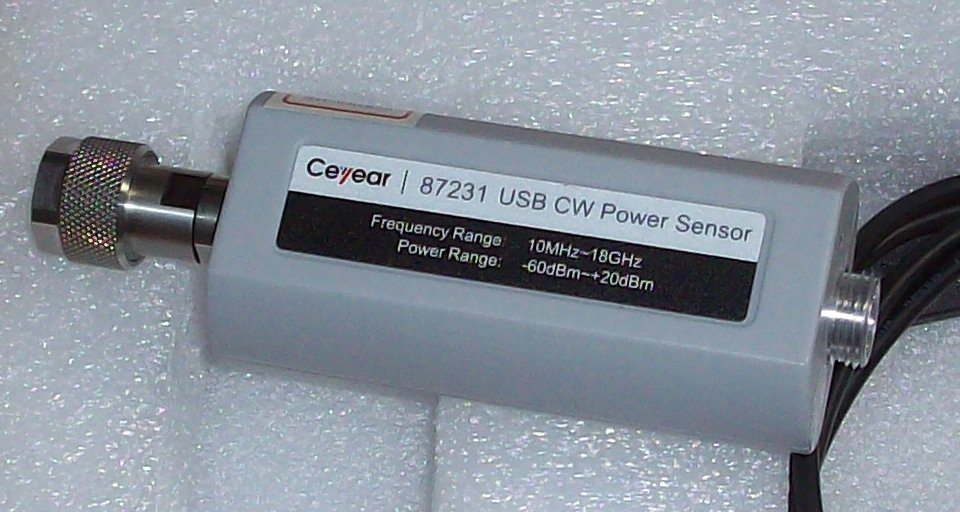

# ceyear-8723x
Driver for Ceyear 8723x RF USB power sensors, based on reverse-engineering of the Windows app.

Currently we only have basic power reading without frequency factor correction, however, this correction is less than 0.1dB on our hardware, so it does not really matter.

## Usage

 * Unload the `usbtmc` module, for example `rmmod usbtmc` and/or create file `/etc/modprobe.d/tmc.conf` with `blacklist usbtmc`
 * Run ./ceyear.py

It outputs current reading and rolling average of last 10 readings.
